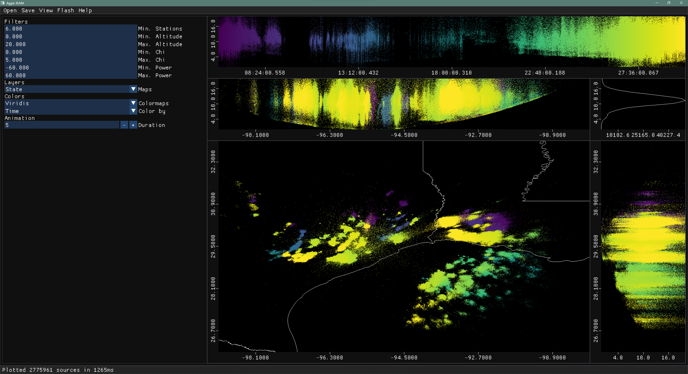

# Aggie XLMA (C++)

A desktop application written in C++ that helps you view, analyze, and interact with LMA ([Lightning Mapping Array](https://lightning.tamu.edu/hlma/)) data. This project is a long-term effort to modernize the existing XLMA application. Our mission is to provide a reliable and fast tool for analysis of lightning data. Plase check the releases tab for the latest version!

## Screenshot:

## Contact:

If you would like to contribute please reach out to [Dr.Timothy Logan](https://artsci.tamu.edu/atmos-science/contact/profiles/timothy-logan.html).

## References:
McCaul , E. W., S. J. Goodman, K. M. LaCasse, and D. J. Cecil, 2009: Forecasting Lightning Threat Using Cloud-Resolving Model Simulations. Wea. Forecasting, 24, 709–729, https://doi.org/10.1175/2008WAF2222152.1.
